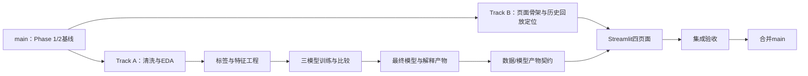

# 整体开发路线

## 1. 文档目的

本文件将已确认的《项目设计大纲》转化为可执行的双轨开发计划，不重新定义项目。所有实现、验收和变更均以根目录 `PROJECT_DESIGN_OUTLINE.md` 为最高设计基线。

## 2. 项目目标与边界

项目建设一个基于 METR-LA 历史数据的城市道路拥堵风险预测与分析辅助系统，形成“数据质量—探索分析—风险预测—模型解释—业务建议—可视化展示”的闭环。

固定边界：

- 产品定位为历史交通数据回放式分析平台，不是实时交通系统。
- 核心数据只使用 METR-LA 和 DCRNN 同源传感器元数据。
- 第一版不增加天气、事故或其他异源数据，不使用深度学习。
- 时间序列必须按时间切分，任何预处理统计只能由训练期计算。
- 业务结论必须能追溯到数据统计、模型指标或解释结果。

## 3. 当前基线

### 已完成

- Phase 1：项目设计大纲确认。
- Phase 2：数据获取、数据审计、数据字典和 EDA 准备完成。
- 数据矩阵：34,272 个时间点 × 207 个传感器，五分钟采样。
- 已识别主要质量风险：大量0值和全网同步0不能直接解释为真实拥堵。

### 尚未开始

- 数据清洗与长表转换。
- 正式 EDA 和拥堵标签生成。
- 特征工程、模型训练、评价和解释。
- Streamlit 页面及系统集成。

## 4. 分支与协作策略

### 长期分支

- `main`：稳定集成分支，只接收通过对应阶段验收的变更。

### 功能分支

- `feature/model-pipeline`：Track A，负责数据、分析、建模、评价和解释链路。
- `feature/streamlit-dashboard`：Track B，负责 Streamlit 展示系统。

### 创建顺序

1. 先在 `main` 建立并提交 Phase 1/2 基线文档及本轮管理文档。
2. 两个功能分支均从同一个已确认的 `main` 基线提交创建。
3. Track A 先定义并固化页面所需的数据/模型产物契约。
4. Track B 可使用符合契约的静态样例开展布局，但不得伪造为正式模型结果。
5. 每条分支独立验收后通过 Pull Request 合并到 `main`；集成修复在对应功能分支完成，不直接在 `main` 开发。

### 文件所有权

| 区域 | 主责任轨道 | 说明 |
|---|---|---|
| `src/data`、`src/features`、`src/models`、`src/analysis` | Track A | 数据与算法实现 |
| `reports/eda`、`reports/modeling` | Track A | EDA与模型正式报告 |
| `app` 或 `src/app` | Track B | Streamlit入口、页面和展示组件 |
| `artifacts/*` 契约 | Track A定义、Track B消费 | 生成文件本体默认不提交Git |
| `docs`、`README.md` | 共享 | 变更时避免同时编辑同一段落 |

## 5. 双轨依赖关系

Track B 可以先完成不依赖正式结果的导航、说明和空状态设计，但“概率、模型指标、特征重要性、业务建议”等正式内容必须等待 Track A 产物，禁止使用无法追溯的演示数字冒充结果。

## 6. 阶段路线

### Phase 3A：数据清洗与EDA

- 将原始宽表转换为可审计长表。
- 实现0值质量标记和系统性缺测识别。
- 完成时间规律、道路排行、速度趋势和拥堵前兆四类分析。
- 输出每张关键图对应的定量业务结论。

### Phase 3B：Dashboard信息架构

- 建立四页面导航与公共展示规范。
- 明确历史时点选择、非实时声明、空状态和错误状态。
- 定义与 Track A 对接的数据结构，不接入虚构模型结果。

### Phase 4A：标签与特征工程

- 只用训练期统计估计每个传感器自由流速度。
- 按已确认规则生成未来30分钟持续拥堵标签。
- 构造只依赖预测时点及之前数据的时间、滞后、滚动和趋势特征。
- 按时间 70%/10%/20% 划分训练、验证、测试集。

### Phase 4B：Dashboard页面实现

- 完成项目介绍、数据分析、预测展示、分析报告四个页面。
- 优先接入正式 EDA 汇总；模型相关区域在正式产物存在前显示明确等待状态。

### Phase 5A：模型、评价与解释

- 实现 Logistic Regression、Random Forest、XGBoost。
- 统一输出 Accuracy、Precision、Recall、F1-score、ROC-AUC。
- 以拥堵类 F1 为主、Recall 和 ROC-AUC 为辅选择最终模型。
- 输出模型比较、误差分析、全局重要性和单次预测解释。

### Phase 5B：系统集成

- Dashboard读取固定版本的数据汇总、模型、指标和解释产物。
- 核对页面数字与离线报告一致。
- 完成性能、异常、可访问性和历史回放口径检查。

### Phase 6：最终验收与答辩交付

- 完成可复现运行说明、最终报告、演示案例和局限声明。
- 对数据、模型和页面做端到端验收。

## 7. 里程碑与放行规则

| 里程碑 | 必要产物 | 放行条件 |
|---|---|---|
| M0 管理基线 | 本轮四份管理文档、README | 用户确认后才编码 |
| M1 数据与EDA | 清洗数据、质量报告、EDA报告 | 0值策略与结论可复核 |
| M2 标签与特征 | 标签说明、特征字典、时间切分 | 无未来泄漏检查通过 |
| M3 模型比较 | 三模型、五指标、比较报告 | 选择规则执行一致 |
| M4 Dashboard | 四页面、历史回放声明 | 无虚构结果、异常状态完整 |
| M5 集成 | 完整Demo、测试记录 | 页面与离线报告一致 |

## 8. 变更控制

任何新增数据源、改变拥堵标签、改变时间切分、增加模型类型或改变产品实时性定位的提议，必须先更新设计/规格文档并获得确认。普通实现细节可在对应轨道内调整，但不得突破设计基线。

