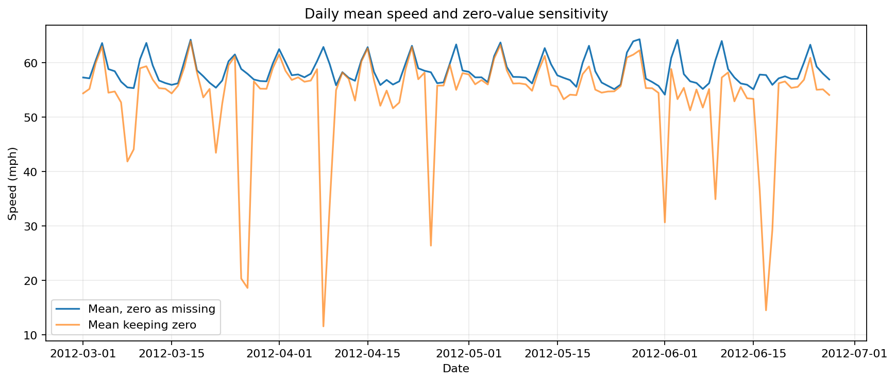
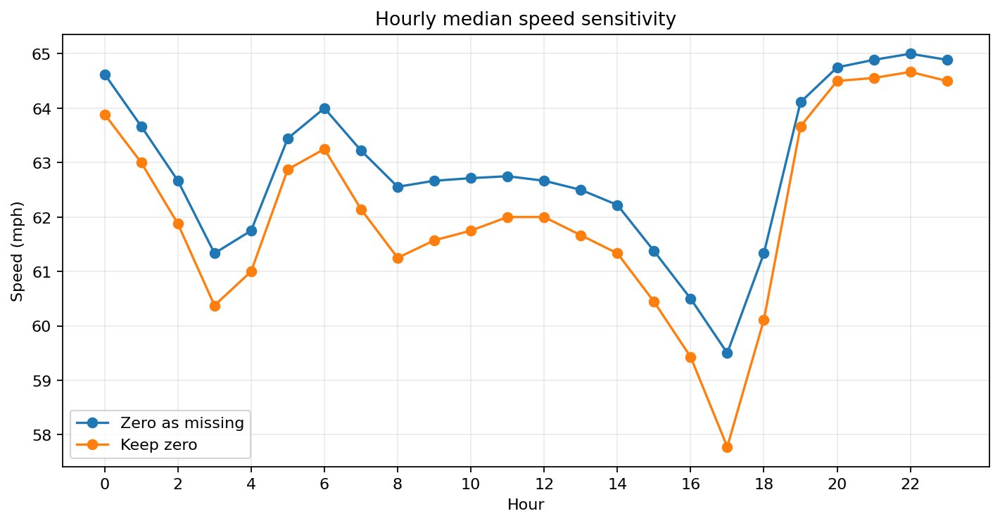
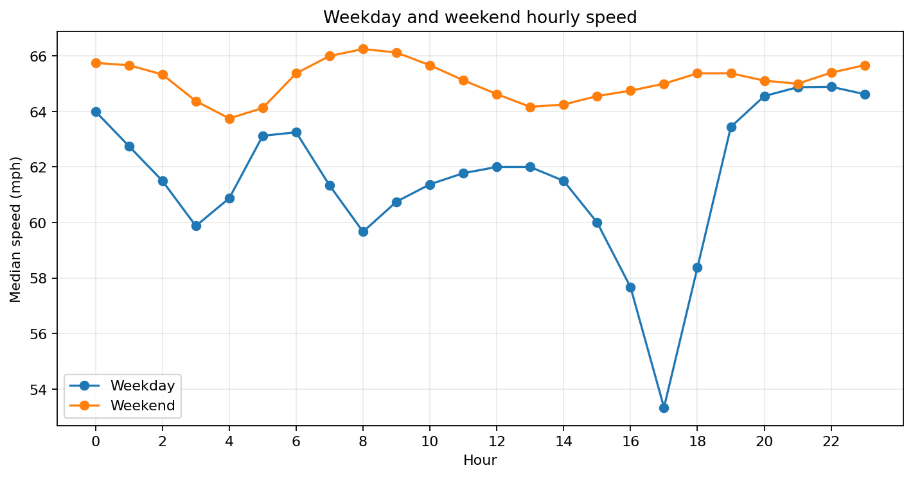
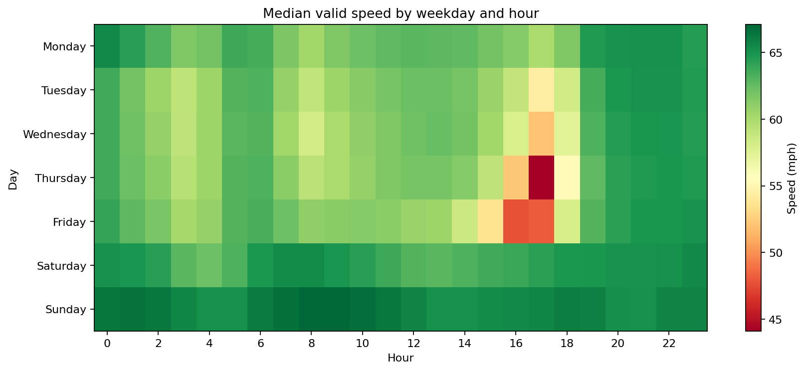
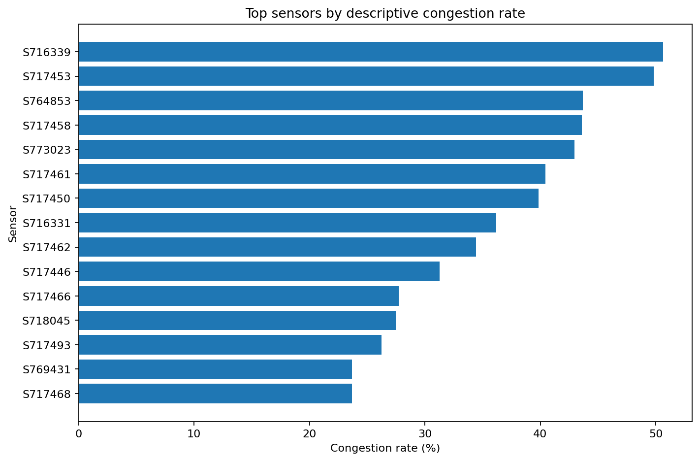
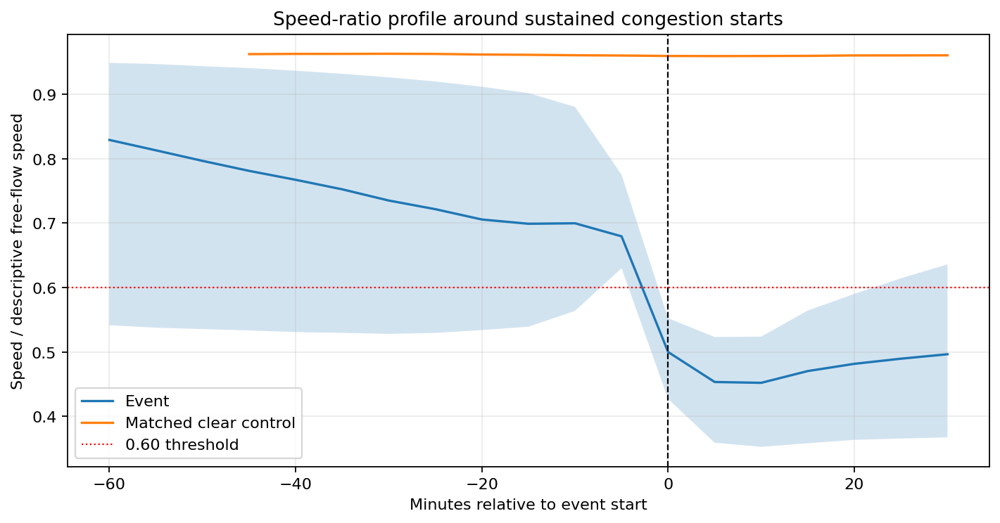

# METR-LA 正式探索性数据分析报告

## 1. 分析范围

本报告使用2012-03-01至2012-06-27的METR-LA历史速度数据完成描述性EDA。主口径把原始0值作为缺测候选排除，同时保留“把0当速度”的敏感性对照。

本阶段没有生成未来30分钟监督标签，没有进行训练/验证/测试切分，也没有训练模型。报告中的“描述性拥堵”仅用于EDA：按每个传感器全期有效速度第85百分位估计描述性自由流速度，速度比低于0.60视为单时点拥堵。该统计不能直接复用到后续模型，建模阶段必须只用训练期重新估计。

## 2. 数据覆盖与0值影响

- 有效正速度观测6,519,002条，占91.8906%。
- 0值/缺测候选575,302条，占8.1094%。
- 如果保留0，每小时速度中位数平均低估0.81 mph，最大低估1.72 mph。
- 按日均值比较，保留0平均低估4.74 mph；在系统性长缺测严重的日期，最大低估51.33 mph。
- 排除0后的每日网络平均速度范围为54.15—64.32 mph，而保留0时最低日均值会下降至11.57 mph。

**业务结论：** 零值会制造并不存在的全网速度崩塌，并显著扭曲日期趋势，因此正式速度规律和道路排行必须使用有效速度口径，同时单独展示缺测率。保留0版本只能作为质量敏感性对照。

## 3. 不同时间段交通规律

### 3.1 全网小时规律

全样本有效速度中位数最低的小时是17时，为59.50 mph；20—23时恢复到64.75—65.00 mph。

### 3.2 工作日与周末

- 工作日7—9时三个小时中位速度的均值为60.58 mph。
- 周末同期为66.13 mph。
- 工作日比周末低5.54 mph。
- “星期×小时”最低单元是星期四17时，中位速度44.13 mph；星期五16—17时也明显偏低，分别为47.78和48.13 mph。

**业务结论：** 工作日早间速度明显低于周末同期，且工作日16—18时下降更加集中，说明通勤车辆集中与周期性速度下降存在稳定关联。管理上应把工作日早高峰和尤其星期四、星期五晚高峰作为历史重点监测窗口，但现有速度数据不能单独证明具体事故或车流量原因。

## 4. 易拥堵道路观测点

道路排行只使用覆盖率至少75%的传感器，避免缺测严重点位靠少量样本进入高风险榜。0.60描述性阈值下：

| 排名 | 传感器 | 有效覆盖率 | 描述性拥堵率 |
|---:|---|---:|---:|
| 1 | 716339 | 93.56% | 50.63% |
| 2 | 717453 | 93.53% | 49.85% |
| 3 | 764853 | 93.52% | 43.66% |
| 4 | 717458 | 93.68% | 43.61% |
| 5 | 773023 | 93.68% | 42.97% |

阈值敏感性结果：0.50与0.60阈值排行的Spearman相关系数为0.976，0.60与0.70为0.971。说明总体高风险点位排序对阈值变化较稳定，但单个点位的绝对拥堵率会变化。

**业务结论：** 传感器716339、717453等点位在不同相对速度阈值下均处于高风险组，应优先纳入历史高峰复盘和后续模型误差分组监测。该排行表示传感器观测点的相对低速频率，不代表完整道路或事故发生概率。

## 5. 道路速度趋势

排除0后，每日网络平均速度主要在54.15—64.32 mph之间变化，并呈明显周周期；保留0版本出现多个与全网同步零值对应的异常深谷。

**业务结论：** 有效速度表现出可预测的周期性，而原始日趋势中的极端下跌主要由数据质量问题驱动。后续模型应显式使用星期、时段和缺测标记，不能把数据恢复后的跳变当作真实交通冲击。

## 6. 拥堵发生前的数据变化

事件定义为速度比低于0.60且至少连续3个五分钟时点（15分钟）。每个事件起点与同一传感器、相同工作日/周末类型、相同五分钟时段的无拥堵窗口匹配。

- 成功匹配事件34,290个，未匹配491个。
- 事件组速度比中位数在事件前60分钟为0.829。
- 前30分钟下降到0.735，前15分钟为0.699。
- 事件起点为0.500。
- 匹配对照在相应前15分钟和事件时刻保持在0.961和0.959。

**业务结论：** 持续拥堵并非只在事件起点突然出现。事件组在提前60分钟已经低于匹配对照，并在最后30分钟继续下降；最近15分钟速度持续走低可作为短时预警的重要信号。该结论来自群体中位数，不能保证每个单次事件都遵循同样轨迹。

## 7. 四项必选EDA结论汇总

1. **时间规律：** 工作日7—9时比周末同期低5.54 mph，晚高峰17时全网中位速度最低。
2. **易拥堵道路：** 716339、717453、764853等点位的描述性拥堵率最高，且阈值变化下总体排序稳定。
3. **速度趋势：** 有效速度呈周周期；原始数据中的异常深谷主要由同步0值造成。
4. **拥堵前兆：** 匹配事件在前60分钟至事件起点的速度比中位数由0.829降至0.500，而对照保持约0.96。

## 8. 局限

- 数据只覆盖约四个月，不能代表全年季节变化。
- 传感器来自洛杉矶高速公路网络，不代表一般城市支路。
- 描述性自由流速度使用全期数据，只适用于EDA，禁止直接用于模型训练。
- 仅凭速度和时间不能确认事故、天气或流量等具体因果原因。
- 0值按缺测候选处理是基于同步性和连续性证据，仍需保留原始值以便追溯。

机器可读汇总见 `eda_summary.json`，完整表格位于 `reports/eda/tables`。

