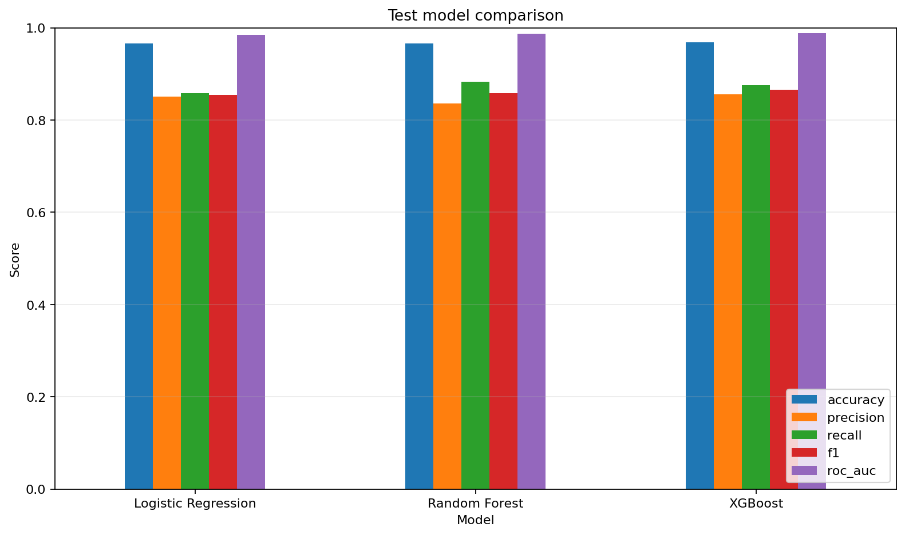
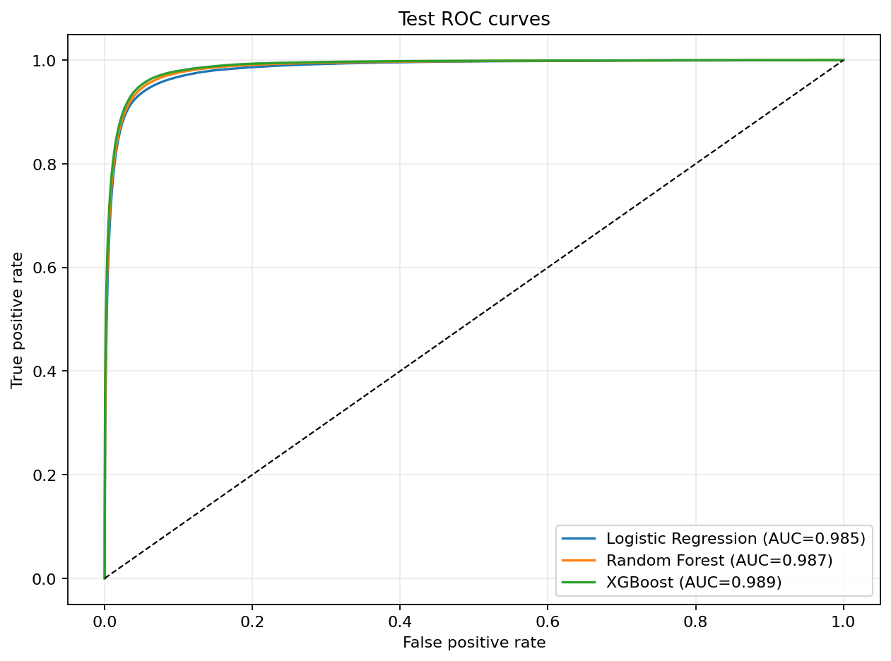
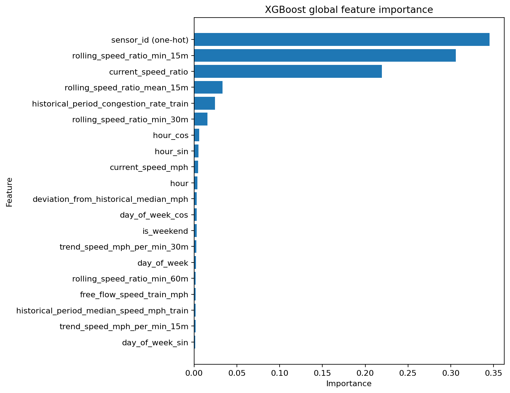

# M3 模型训练、比较与解释报告

## 1. 阶段结论

Logistic Regression、Random Forest 和 XGBoost 均完成训练与统一测试评价。最终按“Validation拥堵类F1 → Recall → ROC-AUC”选择 XGBoost。

- 最终模型：XGBoost。
- Validation F1：0.8644。
- Test Accuracy：0.9680。
- Test Precision：0.8551。
- Test Recall：0.8754。
- Test F1：0.8651。
- Test ROC-AUC：0.9887。
- Validation选择阈值：0.85。

本阶段使用全量Validation/Test，但由于Train有4,361,066行，三模型统一使用固定随机种子42抽取1,000,000行Train样本完成课程级比较。该工程取舍已记录，不改变测试集封闭原则。

## 2. 训练与评价口径

- Train可用样本：4,361,066。
- 实际训练样本：1,000,000，固定`random_state=42`。
- Validation：618,091，全量使用。
- Test：1,149,461，全量使用。
- Train抽样正类：96,043，负类：903,957。
- XGBoost `scale_pos_weight`：9.4120。
- Logistic Regression和Random Forest使用类别权重。
- 预处理只在Train样本拟合：数值标准化、传感器ID One-Hot编码。
- 阈值只在Validation的0.10—0.90网格中按F1、Recall、Precision选择。
- Test只在模型和阈值固定后评价一次。

## 3. 三模型比较

| 模型 | Validation F1 | Test Accuracy | Test Precision | Test Recall | Test F1 | Test ROC-AUC | Test阈值 |
|---|---:|---:|---:|---:|---:|---:|---:|
| Logistic Regression | 0.8528 | 0.9657 | 0.8511 | 0.8580 | 0.8545 | 0.9846 | 0.86 |
| Random Forest | 0.8580 | 0.9659 | 0.8357 | 0.8826 | 0.8585 | 0.9871 | 0.74 |
| XGBoost | **0.8644** | **0.9680** | **0.8551** | 0.8754 | **0.8651** | **0.9887** | 0.85 |





### XGBoost测试集混淆矩阵

```text
              预测非拥堵  预测拥堵
真实非拥堵       994,675     19,994
真实拥堵          16,798    117,994
```

## 4. 最终模型选择

XGBoost在Validation上的拥堵类F1为0.8644，高于Random Forest的0.8580和Logistic Regression的0.8528；其Validation Recall为0.8764、ROC-AUC为0.9894，也保持较高水平。因此选择XGBoost作为最终模型。

Random Forest Recall略高于XGBoost，但Precision较低，综合F1不及XGBoost。Logistic Regression解释透明、性能稳定，保留为线性基线。

## 5. 全局影响因素

XGBoost聚合后的重要性前四项为：

| 排名 | 因素 | 重要性 |
|---:|---|---:|
| 1 | `sensor_id` One-Hot聚合 | 0.3454 |
| 2 | 最近15分钟速度比最小值 | 0.3059 |
| 3 | 当前速度比 | 0.2196 |
| 4 | 训练期历史同期拥堵率 | 0.0245 |



`sensor_id`的重要性较高，说明不同观测点的长期基线差异明显；它是位置类别差异，不应解释为“编号本身导致拥堵”。在业务解释中应同时展示速度比、滚动低点和历史同期拥堵率，避免把传感器身份误当成可干预原因。

Logistic Regression和Random Forest完整重要性排名见：

- `feature_importance_logistic_regression.csv`
- `feature_importance_random_forest.csv`
- `feature_importance_xgboost.csv`

## 6. 单次高风险解释

代表样本：传感器763995，历史时点2012-06-08 15:25，XGBoost拥堵概率0.9998，实际标签为1。

主要局部因素：

1. 训练期历史同期拥堵率为0.9259，明显高于训练参考0.0。
2. 当前速度比为0.1242，远低于训练期正常水平参考约0.9596。
3. 最近15分钟平均速度比为0.1249，说明低速不是单点瞬时波动。
4. 当前速度为8.625 mph，较训练参考63.22 mph明显偏低。

单特征反事实概率变化用于表达“模型支持方向”，不是因果效应估计；完整结果见 `local_explanation.json`。

## 7. 业务结论

- 当前速度比和最近15分钟滚动低点是最直接的短时风险信号，速度持续处于低位时应优先关注。
- 历史同期拥堵率可作为点位先验，适合支持高峰监测排序，但不能替代当前状态。
- 传感器类别重要性高，说明模型需要保留点位差异；页面解释必须把它翻译为“该观测点的历史基线差异”，不能说传感器编号造成拥堵。
- XGBoost在当前固定标签和时间测试集上综合效果最佳，但Test正类率11.73%高于Train的9.60%，存在时间分布变化，后续Dashboard需展示模型适用边界。

## 8. 局限与复现

- Train使用固定100万样本而非全部436万样本，后续可作为扩展实验比较全量训练收益。
- METR-LA只提供速度和同源传感器信息，模型不能诊断事故、天气或交通流量因果。
- 概率阈值0.85是在Validation选择，不能直接解释为85%的现实频率保证。
- 模型文件保存于本地`artifacts/models`，受Git忽略，不提交二进制。

机器可读结果：`m3_summary.json`、`model_comparison.csv`、`validation_thresholds.json`和`local_explanation.json`。

